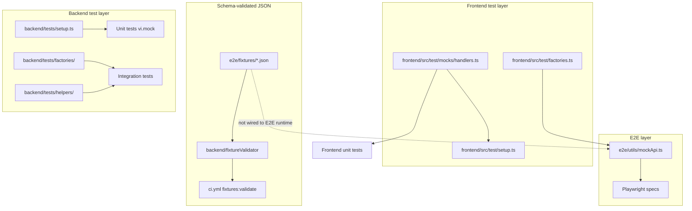

# Fixture Audit Report

**Repository:** StellaBridge/Bridge-Watch  
**Last reviewed:** 2026-06-23  
**Related issue:** #545

This document inventories reusable test fixtures and sample data sets across the Bridge-Watch monorepo. It covers static JSON payloads, programmatic factories, global mocks, database seeds, and contract snapshots — along with how they are consumed, who maintains them, and how CI keeps them aligned with the live API.

---

## Table of Contents

1. [Executive Summary](#executive-summary)
2. [Fixture Inventory](#fixture-inventory)
3. [Usage Notes](#usage-notes)
4. [Ownership](#ownership)
5. [Update Process](#update-process)
6. [CI Alignment](#ci-alignment)
7. [Known Gaps and Recommendations](#known-gaps-and-recommendations)
8. [Related Documentation](#related-documentation)

---

## Executive Summary

Bridge-Watch uses **Vitest** (backend and frontend), **Playwright** (E2E), and **Cargo test** (Soroban contracts). There is no pytest or `conftest.py`; shared test data lives in layered fixtures:

| Layer | Primary location | Validation |
| --- | --- | --- |
| Schema-validated JSON | `e2e/fixtures/*.json` | Zod schemas + `fixtures:validate` CI gate |
| Frontend type factories | `frontend/src/test/factories.ts` | TypeScript types from `frontend/src/types` |
| Backend DB factories | `backend/tests/factories/` | Integration tests against real Postgres |
| MSW handlers | `frontend/src/test/mocks/handlers.ts` | Manual alignment with API shapes |
| E2E route mocks | `e2e/utils/mockApi.ts` | Uses frontend factories (not JSON files) |
| Contract snapshots | `contracts/**/test_snapshots/` | Soroban env regression snapshots |

Three canonical JSON fixtures (`assets`, `bridges`, `asset-health`) are registered in the fixture validator and enforced in CI. E2E tests run against programmatic factories via `mockCoreApi`, not the JSON files directly — a drift risk called out below.

---

## Fixture Inventory

### 1. Schema-validated static JSON (`e2e/fixtures/`)

| Fixture file | API surface | Sample content | Registered in |
| --- | --- | --- | --- |
| [`e2e/fixtures/assets.json`](../e2e/fixtures/assets.json) | `GET /api/v1/assets` | USDC, EURC asset list (`total: 2`) | [`backend/src/testing/fixtureValidator/registry.ts`](../backend/src/testing/fixtureValidator/registry.ts) |
| [`e2e/fixtures/bridges.json`](../e2e/fixtures/bridges.json) | `GET /api/v1/bridges` | Allbridge (healthy), Wormhole (degraded) with TVL/supply/mismatch | Same |
| [`e2e/fixtures/asset-health.json`](../e2e/fixtures/asset-health.json) | `GET /api/v1/assets/:symbol/health` | Per-symbol health scores for USDC and EURC | Same |

**Validation stack:**

| File | Role |
| --- | --- |
| [`backend/src/testing/fixtureValidator/schemas.ts`](../backend/src/testing/fixtureValidator/schemas.ts) | Zod schemas aligned with `frontend/src/types` |
| [`backend/src/testing/fixtureValidator/validator.ts`](../backend/src/testing/fixtureValidator/validator.ts) | Drift detection (errors and warnings) |
| [`backend/scripts/validate-fixtures.ts`](../backend/scripts/validate-fixtures.ts) | CLI entry point |
| [`backend/tests/testing/fixtureValidator.test.ts`](../backend/tests/testing/fixtureValidator.test.ts) | Unit tests for validator + committed fixtures |

See [backend/docs/FIXTURE_VALIDATION.md](../backend/docs/FIXTURE_VALIDATION.md) for operational details.

---

### 2. Frontend type factories (`frontend/src/test/factories.ts`)

Deterministic builders using a seeded PRNG. Shared with E2E via `e2e/utils/mockApi.ts`.

| Builder | Returns | Default behaviour |
| --- | --- | --- |
| `buildAsset()` | `Asset` | XLM or USDC (seed-driven) |
| `buildHealthFactors()` | `HealthFactors` | Random factor scores 0–100 |
| `buildHealthScore()` | `HealthScore` | Overall score 60–100, trend improving/stable |
| `buildAssetWithHealth()` | `AssetWithHealth` | Asset + nested health score |
| `buildBridge()` | `Bridge` | Stellar-Ethereum/Celo bridge, healthy/degraded |
| `buildDependencyGraph()` | `DependencyGraph` | Service dependency graph for health UI |

---

### 3. Backend database factories (`backend/tests/factories/index.ts`)

Async Knex helpers that insert rows for integration tests.

| Factory | Default entity | Table |
| --- | --- | --- |
| `createAsset()` | USDC, Circle, Ethereum | `assets` |
| `createBridge()` | circle, healthy, TVL 1M | `bridges` |
| `createAlertRule()` | USDC price-deviation rule | `alert_rules` |
| `createPriceRecord()` | USDC @ $1.00, coinbase | `prices` |
| `createHealthScore()` | USDC overall 95 | `health_scores` |

---

### 4. Global mocks and test helpers

#### Backend unit setup — [`backend/tests/setup.ts`](../backend/tests/setup.ts)

- In-memory **ioredis** mock (sorted sets, pipeline, pub/sub)
- **bullmq** `Queue`/`Worker` stubs
- Test env vars for Postgres and Redis

#### Backend integration helpers — [`backend/tests/helpers/`](../backend/tests/helpers/)

| File | Functions | Purpose |
| --- | --- | --- |
| `db.ts` | `runMigrations`, `resetDatabase`, `truncateTables`, `cleanDatabase` | DB lifecycle |
| `redis.ts` | `flushRedis()` | Redis isolation between tests |
| `externalApiMock.ts` | `mockExternalApis()`, `restoreExternalApisMock()` | Sequential `fetch` stubbing |

Integration suite bootstrap: [`backend/tests/integration/setup.ts`](../backend/tests/integration/setup.ts).

#### Frontend MSW stack — [`frontend/src/test/mocks/`](../frontend/src/test/mocks/)

| File | Role |
| --- | --- |
| `handlers.ts` | Default handlers for assets, bridges, asset health, price, search, external-dependencies |
| `server.ts` | MSW `setupServer(...handlers)` |
| `setup.ts` | MSW lifecycle, vitest-axe matchers, RTL cleanup |
| `utils.tsx` | Custom `render()` with `QueryClientProvider` + `MemoryRouter` |

#### E2E API mocking — [`e2e/utils/mockApi.ts`](../e2e/utils/mockApi.ts)

- `mockCoreApi(page)` intercepts Playwright routes
- Builds responses from `buildAssetWithHealth` and `buildBridge` (not `e2e/fixtures/*.json`)

#### SDK helpers — [`sdk/src/testing.ts`](../sdk/src/testing.ts)

| Helper | Purpose |
| --- | --- |
| `createMockScValString()` | Soroban XDR string ScVal |
| `createMockScValU64()` | Soroban XDR u64 ScVal |
| `createMockEvent()` | Contract event stub |
| `createMockWatchSubscription()` | Subscription lifecycle stub |

Tested in [`sdk/src/testing.test.ts`](../sdk/src/testing.test.ts).

---

### 5. Database seeds (dev/bootstrap, not test fixtures)

| File | Content |
| --- | --- |
| [`backend/src/database/seeds/01_assets_and_bridges.ts`](../backend/src/database/seeds/01_assets_and_bridges.ts) | XLM, USDC, PYUSD, EURC, FOBXX + Circle bridges |
| [`backend/src/database/seeds/02_circuit_breaker_configs.ts`](../backend/src/database/seeds/02_circuit_breaker_configs.ts) | Default circuit-breaker thresholds |
| [`backend/src/database/seeds/03_asset_metadata.ts`](../backend/src/database/seeds/03_asset_metadata.ts) | Logos, social links, specs per asset |
| [`backend/src/database/seed.ts`](../backend/src/database/seed.ts) | Seed runner |
| [`scripts/init-db.sql`](../scripts/init-db.sql) | Postgres extensions (TimescaleDB, pg_stat_statements) |

Seeds populate local/dev databases. Integration tests use factories + truncate helpers instead.

---

### 6. Soroban contract fixtures

| Location | Type |
| --- | --- |
| `contracts/soroban/src/relay/mod.rs` | In-module `setup_context()` |
| `contracts/soroban/tests/relay_contract_integration.rs` | External integration `setup_context()` |
| `contracts/soroban/tests/relay_contract_fuzz.rs` | Fuzz `setup_context()` |
| `contracts/transfer_state_machine/test_snapshots/tests/*.json` | Transfer state machine env snapshots (~20 files) |
| `contracts/soroban/test_snapshots/relay/tests/*.json` | Relay contract env/auth/state snapshots |

Pattern documented in [`contracts/soroban/tests/README.md`](../contracts/soroban/tests/README.md).

---

### 7. Inline / ad-hoc mock data (not centralized)

| Location | Pattern |
| --- | --- |
| `frontend/src/test/mocks/handlers.ts` | Inline JSON in MSW handlers (XLM/USDC, Circle/Wormhole) |
| `frontend/src/hooks/useBridgeSummary.test.tsx` | Inline `mockBridges` / `mockStats` arrays |
| `frontend/src/components/*.stories.tsx` | Storybook mock props |
| `frontend/tests/visual/dashboard.spec.ts` | Per-test Playwright `page.route()` bodies |
| `backend/tests/services/*.test.ts` | Per-file `vi.mock()` of DB, Redis, Stellar, Ethereum |
| `load-tests/config/baselines.js` | k6 performance thresholds (smoke/ramp/spike/endurance) |

---

## Usage Notes

### Fixture → consumer matrix

| Fixture / helper | Primary consumers |
| --- | --- |
| `e2e/fixtures/*.json` | Fixture validator, `fixtureValidator.test.ts`, CI `fixtures:validate` |
| `frontend/src/test/factories.ts` | [`e2e/utils/mockApi.ts`](../e2e/utils/mockApi.ts) |
| `frontend/src/test/mocks/handlers.ts` | All frontend unit tests via global MSW setup |
| `backend/tests/factories/` | [`models.integration.test.ts`](../backend/tests/integration/db/models.integration.test.ts), [`alerts.integration.test.ts`](../backend/tests/integration/api/alerts.integration.test.ts), [`bridges.integration.test.ts`](../backend/tests/integration/api/bridges.integration.test.ts) |
| `backend/tests/helpers/` | Integration tests (DB reset, Redis flush, external API mocks) |
| `mockCoreApi` | [`critical-flows.spec.ts`](../e2e/tests/critical-flows.spec.ts), [`mobile-navigation.spec.ts`](../e2e/tests/mobile-navigation.spec.ts), [`ui-interactions.spec.ts`](../e2e/tests/ui-interactions.spec.ts) |
| `sdk/src/testing.ts` | [`sdk/src/testing.test.ts`](../sdk/src/testing.test.ts) only |

### When to use which fixture

| Scenario | Recommended approach |
| --- | --- |
| API shape regression gate | Update `e2e/fixtures/*.json` and run `fixtures:validate` |
| Frontend component/hook test | MSW defaults in `handlers.ts`; override with `server.use()` per test |
| E2E Playwright flow | `mockCoreApi(page)` in `beforeEach` |
| Backend integration test with DB | `backend/tests/factories/` + `cleanDatabase` / `truncateTables` |
| Backend unit test | Per-file `vi.mock()` (no shared factory today) |
| Soroban contract test | `setup_context()` + snapshot assertions |
| Local dev database | `npm run seed` (seeds, not test fixtures) |

### Data-flow overview



---

## Ownership

There is no `CODEOWNERS` file. Ownership follows team areas (same pattern as [secrets-audit-checklist.md](./secrets-audit-checklist.md)):

| Fixture area | Owner team | Review trigger |
| --- | --- | --- |
| `e2e/fixtures/*.json` + fixture validator | Platform Engineering | API response shape changes |
| `frontend/src/test/factories.ts` | Frontend / Platform Engineering | `frontend/src/types` changes |
| `frontend/src/test/mocks/handlers.ts` | Frontend / Platform Engineering | New or changed API routes used by UI |
| `e2e/utils/mockApi.ts` | Platform Engineering + QA | E2E flow or core API mock changes |
| `backend/tests/factories/` | Platform Engineering | Database schema or model changes |
| `backend/tests/helpers/` | Platform Engineering | Integration test infra changes |
| `backend/tests/setup.ts` (Redis/BullMQ mocks) | Platform Engineering | Queue or cache client changes |
| `sdk/src/testing.ts` | Platform Engineering | Soroban SDK type changes |
| Contract `test_snapshots/` | Smart Contracts | Soroban contract interface changes |
| Database seeds | Platform Engineering | Dev bootstrap data changes |

**Maintainers:** Any contributor may update fixtures in a PR; the owning team reviews changes that touch their area. See [CONTRIBUTING.md](../CONTRIBUTING.md) for the general review process.

---

## Update Process

### Updating schema-validated JSON fixtures

1. Update types in `frontend/src/types` and the Zod schema in `backend/src/testing/fixtureValidator/schemas.ts`.
2. Run `npm --workspace=backend run fixtures:validate` and fix reported drift.
3. Update the JSON file(s) under `e2e/fixtures/`.
4. Re-run validation until **PASS**.
5. Run `npm --workspace=backend run test` (includes `fixtureValidator.test.ts`).

Full walkthrough: [backend/docs/FIXTURE_VALIDATION.md](../backend/docs/FIXTURE_VALIDATION.md).

### Adding a new registered fixture

1. Add the file under `e2e/fixtures/`.
2. Add a schema to `backend/src/testing/fixtureValidator/schemas.ts`.
3. Register it in `backend/src/testing/fixtureValidator/registry.ts`.
4. Add a test case in `backend/tests/testing/fixtureValidator.test.ts` if needed.

### Updating frontend factories or MSW handlers

1. Change `frontend/src/types` first if the domain shape changed.
2. Update `frontend/src/test/factories.ts` and/or `frontend/src/test/mocks/handlers.ts`.
3. If E2E mocks the same surface, update `e2e/utils/mockApi.ts`.
4. If a canonical JSON fixture exists for that API, update `e2e/fixtures/` and re-validate.
5. Run `npm --workspace=frontend test` and `npm run test:e2e`.

### Updating backend DB factories

1. Align factory defaults with the current migration schema.
2. Update integration tests that assert on factory output.
3. Run `npm --workspace=backend run test:integration`.

### Updating contract snapshots

1. Run `cargo test` in `contracts/` after intentional contract changes.
2. Review snapshot diffs; commit updated JSON only when behaviour change is expected.
3. See [contracts/soroban/tests/README.md](../contracts/soroban/tests/README.md).

### Review checklist (for PR authors)

- [ ] Types, schemas, and fixture payloads stay aligned
- [ ] `fixtures:validate` passes when JSON fixtures changed
- [ ] E2E `mockCoreApi` updated if core API mock shapes changed
- [ ] MSW handlers updated if frontend tests depend on the changed route
- [ ] Integration factories updated if DB columns changed
- [ ] This audit report updated if new fixture categories are introduced

---

## CI Alignment

| Workflow | Fixture-related step |
| --- | --- |
| [`.github/workflows/ci.yml`](../.github/workflows/ci.yml) | `npm --workspace=backend run fixtures:validate` after backend lint; backend tests include `fixtureValidator.test.ts` |
| [`.github/workflows/integration-tests.yml`](../.github/workflows/integration-tests.yml) | Separate unit vs integration jobs with Postgres + Redis service containers |
| [`.github/workflows/e2e.yml`](../.github/workflows/e2e.yml) | Playwright E2E using `mockCoreApi` (factory-based mocks) |
| [`.github/workflows/code-quality.yml`](../.github/workflows/code-quality.yml) | ESLint, Clippy, dependency review |

### Local pre-push commands

```bash
# Validate JSON fixtures against API schemas
npm --workspace=backend run fixtures:validate

# Backend unit + integration (includes fixture validator tests)
npm --workspace=backend run test

# Frontend unit tests (MSW-backed)
npm --workspace=frontend test

# E2E (Playwright + mockCoreApi)
npm run test:e2e

# Soroban contracts
cd contracts && cargo test
```

Strict mode (warnings fail): `npm --workspace=backend run fixtures:validate -- --strict`

---

## Known Gaps and Recommendations

| Gap | Risk | Recommendation |
| --- | --- | --- |
| E2E uses factories, not `e2e/fixtures/*.json` | JSON and runtime E2E mocks can diverge | Wire `mockCoreApi` to load registered JSON fixtures, or document factories as the E2E source of truth |
| Frontend factories underused in unit tests | Duplicate inline mock shapes | Prefer `buildAssetWithHealth` / `buildBridge` over inline arrays in new tests |
| Backend factories limited to integration tests | Unit tests duplicate DB shapes via `vi.mock()` | Acceptable today; consider shared mock builders for high-traffic services |
| No centralized fixtures for alerts, search, webhooks | Each test invents its own payload | Add JSON + schema when those routes gain E2E or contract-test coverage |
| Rust snapshots not in Node validator | Separate review path for contract changes | Keep contract snapshot review in Soroban PR checklist |

---

## Related Documentation

| Document | Topic |
| --- | --- |
| [backend/docs/FIXTURE_VALIDATION.md](../backend/docs/FIXTURE_VALIDATION.md) | Fixture validator CLI and schema workflow |
| [docs/UNIT_TESTING_INFRASTRUCTURE.md](./UNIT_TESTING_INFRASTRUCTURE.md) | Vitest setup, coverage, CI integration |
| [docs/E2E_TESTING_GUIDE.md](./E2E_TESTING_GUIDE.md) | Playwright architecture and test data patterns |
| [frontend/docs/TESTING.md](../frontend/docs/TESTING.md) | MSW, custom render, accessibility testing |
| [CONTRIBUTING.md](../CONTRIBUTING.md) | Test factories and integration helpers for contributors |
| [contracts/soroban/tests/README.md](../contracts/soroban/tests/README.md) | Soroban test fixture patterns |

---

*Next review: update this report when new fixture categories are added or when the fixture validator registry changes.*
