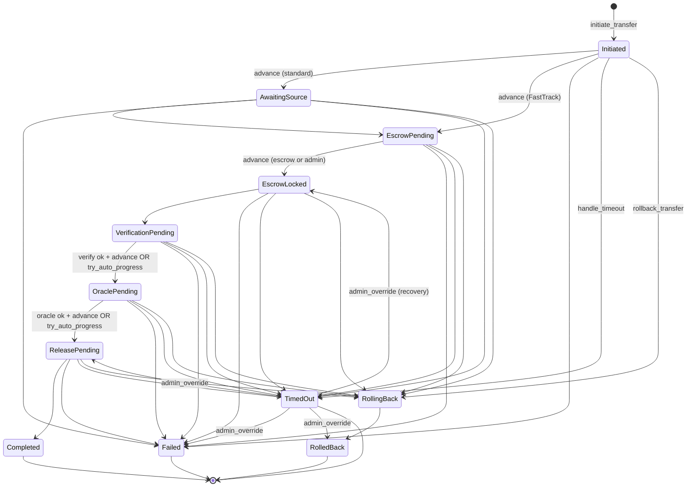

# Transfer state machine contract

Soroban contract crate: `contracts/transfer_state_machine` (workspace member under `contracts/`).

This contract models the **lifecycle of a single bridge transfer** with explicit states, enforced transitions, per-state timeouts, append-only transition history, events, and hooks for **escrow**, **verification**, and **oracle** integrations (configured contract addresses).

Related design references in this repo:

- Time-locked escrow: [time-locked-escrow-contract.md](./time-locked-escrow-contract.md)
- Reserve / commitment verification: `contracts/soroban/src/bridge_reserve_verifier.rs`

## State transition diagram



## Public API (summary)

| Function | Purpose |
|----------|---------|
| `initialize` | One-time admin setup and default timeouts. |
| `set_integration_contracts` | Escrow, verifier, oracle `Address` values. |
| `set_default_timeout` / `set_state_timeout` | Configurable deadlines per state. |
| `initiate_transfer` | Create transfer (`Initiated`). |
| `verify_transition` | Read-only: whether `from → to` is valid for the stored record. |
| `advance_state` | Authorized transition (caller rules vary by edge). |
| `handle_timeout` | Permissionless move to `TimedOut` when `state_deadline` passed. |
| `rollback_transfer` | Initiator or admin: `RollingBack` → `RolledBack`. |
| `admin_override_state` | Admin recovery from `TimedOut` (and limited other overrides). |
| `submit_verification_result` | Verifier contract only. |
| `submit_oracle_result` | Oracle contract only. |
| `try_auto_progress` | Permissionless automated step when flags allow. |
| `get_transfer` / `get_transition_history` | Persistence & recovery reads. |
| `get_timeout_for_state` | Inspect effective timeout seconds. |

## Events

Short symbols (`tr_init`, `tr_adv`, `tr_to`, `tr_rb`, `tr_adm`, `tr_vrf`, `tr_orc`, `tr_aut`) are emitted on create, transition, timeout, rollback, admin override, verification, oracle, and auto-progress.

## Test coverage

Run unit tests:

```bash
cd contracts
cargo test -p transfer-state-machine
```

For LLVM line coverage (optional tool):

```bash
cargo install cargo-llvm-cov
cd contracts
cargo llvm-cov -p transfer-state-machine --summary-only
```

## Build WASM

From `contracts/`:

```bash
cargo build -p transfer-state-machine --target wasm32-unknown-unknown --release
```

Artifact: `target/wasm32-unknown-unknown/release/transfer_state_machine.wasm` (exact name may vary by Rust crate naming).
